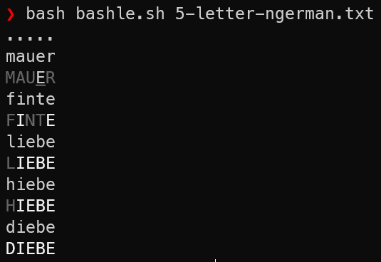

# Bashle - Wordle in pure bash

As a little coding challenge, I rewrote wordle in pure bash - without using tools like `grep`, `tr`, `sed`, etc. 

To start playing, just run

```
bash bashle.sh <dict>
```

where `<dict>` is the filename of a dictonary, i.e. a newline separated list of words. For example:



Feedback is given as follows:

- Letters that are at the correct position are formatted in bold face.
- Letters that occur within the word but are not at the correct position are underlined.
